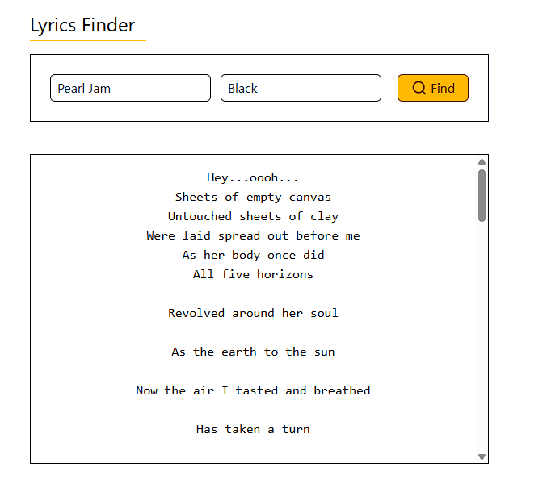

# Lyrics Finder

This is a project built with Vite that allows you to search for song lyrics using the Lyrics.ovh API.

## 🛠 Technologies Used

- React
- Vite
- Axios
- Tailwind CSS
- Lucide React

## 📦 Installation and Usage

1. Clone this repository:

```
git clone https://github.com/DropperDEV/lyrics-finder
```

2. Navigate to the project folder:

```
cd Lyrics-Finder
```

3. Install the dependecies:

```
npm install
```

or

```
yarn install
```

4. Start the development server:

```
npm run dev
```

or

```
yarn dev
```

5. Access the project in your browser:

```
http://localhost:5173
```

## 🚀 Features

Search for song lyrics by artist and song name.
Modern and responsive interface.
Uses Tailwind CSS for styling.

## 📸 Screenshot



## 📜 License

This project is licensed under the MIT License.

## 🙌 Contributing

Feel free to open issues and pull requests for improvements!

Made with ❤️ by [James Costa](https://github.com/DropperDEV)
